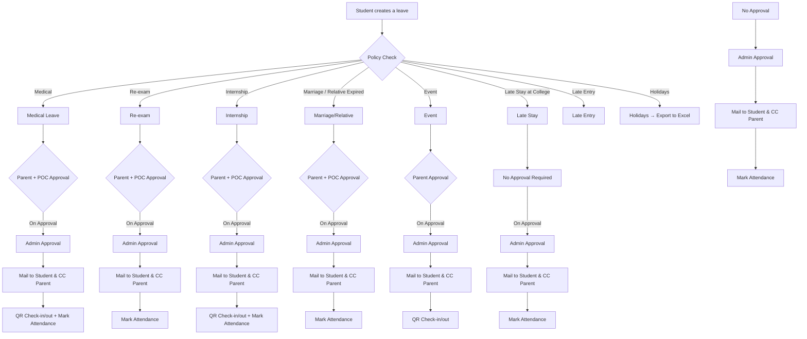

This is actually a very strong direction architecturally.

You’re no longer building just a “leave system.”
You’re building a **Policy Enforcement & Validation Engine** for hostel + academic workflows.

The policies you pasted define:

- eligibility rules
- deadlines
- escalation conditions
- required documents
- role approvals
- exception handling
- review workflows
- conditional branching
- verification logic
So the correct architecture is:

---

# High-Level Architecture
```text
User Request
↓
Request Parser
↓
Policy Engine
↓
Validation Layer
↓
Decision Engine
↓
Workflow Generator
↓
Approval Pipeline
↓
Notifications + Audit Logs
```
---

# What You Actually Need
You need a dedicated:

# Policy Validation Layer
This layer decides:

- Is the request valid?
- Which approvals are required?
- Which documents are mandatory?
- Are deadlines satisfied?
- Is parent verification needed?
- Does this qualify as emergency exemption?
- Does this need warden escalation?
- Is this auto-rejectable?
---

# Core Idea
Instead of hardcoding:

```ts
if (leaveType === "medical") ...
```
You create:

# Declarative Policy Rules
Example:

```json
{
"policyId": "medical_leave_exemption",
"category": "attendance_exemption",
"conditions": {
  "medicalEmergency": true,
  "daysExceeded": 5
},
"requiredApprovals": [
  "parent",
  "warden"
],
"requiredDocuments": [
  "medical_certificate",
  "prescription",
  "warden_email"
],
"submissionWindow": {
  "beforeDays": 3,
  "afterEmergencyDays": 5
}
}
```
---

# System Components
# 1. Policy Engine
Responsible for:

- loading policies
- evaluating rules
- generating validation errors
- determining workflow path
---

# 2. Validation Layer
Checks:

```text
- dates valid?
- submission deadline valid?
- required docs uploaded?
- emergency qualifies?
- approvals attached?
- official email used?
- leave exceeds 5 days?
- attendance exemption eligible?
```
---

# 3. Workflow Generator
Generates workflow dynamically.

Example:

```text
Medical Emergency (>5 days)
↓
Parent Verification
↓
Warden Approval
↓
Document Verification
↓
Committee Review
↓
Final Decision
```
---

# 4. Document Verification Layer
Checks uploaded files:

- medical certificate
- prescriptions
- approval emails
- screenshots
- PDFs
- PNGs
Validates:

- format
- file size
- required attachments
---

# 5. Approval Engine
Supports:

```text
- Parent approval
- Warden approval
- Faculty approval
- Dean approval
- Exam committee approval
```
---

# 6. Deadline Engine
This is important.

Your policy has many timing rules.

Example:

```text
Attendance exemption:
- 3 days before session
- 5 days after emergency

Exam exemption:
- 48 hours before exam
- 3 days after emergency
```
So you need:

```ts
validateDeadline(policy, submissionDate, eventDate)
```
---

# 7. Exception Classification
You need request classification.

Example:

```text
Medical Emergency
Non-medical Emergency
Bereavement
Hackathon/Event
Technical Issue
Internship
Family Emergency
```
Each has different rules.

---

# BEST ARCHITECTURE
Do NOT hardcode all policies in services.

Instead:

# Recommended Structure
```text
src/
├── policies/
│    ├── attendance/
│    ├── exams/
│    ├── hostel/
│    └── shared/
│
├── policy-engine/
│    ├── evaluator.ts
│    ├── validators.ts
│    ├── workflow.ts
│    └── deadline.ts
│
├── rules/
│    ├── medical.rule.ts
│    ├── bereavement.rule.ts
│    ├── hackathon.rule.ts
│    └── reexam.rule.ts
```
---

# Recommended Data Model
# Policy Table
```sql
policies
---------
id
name
category
is_active
version
created_at
```
---

# Policy Rules Table
```sql
policy_rules
-------------
id
policy_id
rule_type
operator
value
metadata
```
---

# Submission Table
```sql
submissions
------------
id
student_id
policy_type
status
submitted_at
```
---

# Approval Table
```sql
approvals
----------
id
submission_id
approver_role
status
approved_at
```
---

# Workflow State Machine
You should implement state-driven workflows.

Example:

```text
DRAFT
↓
SUBMITTED
↓
UNDER_VALIDATION
↓
PARENT_PENDING
↓
WARDEN_PENDING
↓
COMMITTEE_PENDING
↓
APPROVED / REJECTED
↓
ARCHIVED
```
---

# Why This Matters
Because policies WILL change.

Tomorrow they may add:

- sports exemption
- internship exceptions
- international travel
- semester freeze
- remote attendance
If hardcoded → nightmare.

If rule-driven → scalable.

---

# Suggested Tech Stack
```text
Frontend:
- Next.js
- shadcn/ui
- Tailwind

Backend:
- Next.js API / FastAPI

Database:
- PostgreSQL

Rule Engine:
- JSON-based rule system
OR
- DSL-based policy engine

Workflow:
- State machine

Validation:
- Zod
```
---

# Best Long-Term Direction
Eventually evolve this into:

# Academic Governance Engine
Not just leave management.

The same engine can later power:

- attendance exemptions
- re-exams
- hostel permissions
- disciplinary workflows
- approvals
- scholarship exceptions
- event permissions
- medical compliance
That’s the real scalable system here.

---

# Workflow Diagram

The following diagram maps leave categories to their approval chains and post-approval actions:



## Notes from Diagram

- **Extension support**: Hostel leaves must allow extensions with separate approval flow.
- **QR check-in/out**: Required for Medical, Internship, and Event categories. Optional for others.
- **Assignment rules**: 2 hostels → 2 different admins fetched from DB. Some categories have different assignment rules.
- **Exam blocking**: Can take exam date as input and check in policy.
- **Long leaves / Different hostel stays**: Additional categories requiring separate handling.
- **Blocking leave creation**: Might need to block leave creation option during certain periods.

> Raw diagram data available in [`v1.excalidraw.json`](./v1.excalidraw.json) for editing in [Excalidraw](https://excalidraw.com).

